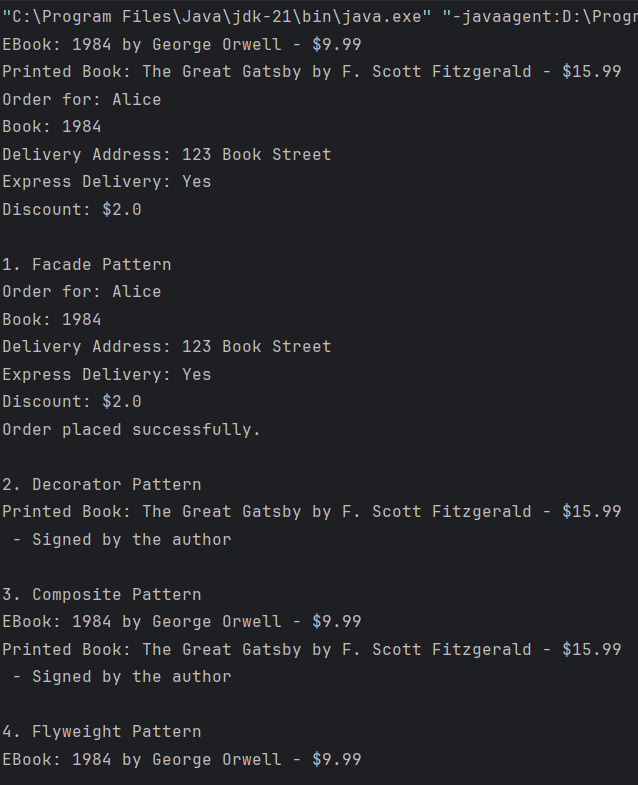
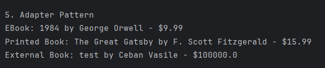

# Topic: Structural Design Patterns

**Author:** Ceban Vasile
---

## Introduction

Structural design patterns are a fundamental part of software engineering, providing solutions to efficiently create complex object structures. Unlike creational patterns that deal with object creation, structural patterns focus on how objects and classes are organized. This allows us to enhance or extend existing code while promoting flexibility and maintainability. In this project, I have integrated structural patterns into a Library Management System to provide additional functionalities and improve the design.

## Theory and Motivation

In software development, there are instances where objects need to be combined or modified in a way that improves functionality without altering their internal structure. Structural design patterns provide a way to do this through composition and inheritance. They allow for code that is modular, extendable, and easier to manage as the system grows.

### Examples of Structural Patterns

- **Adapter**: Allows incompatible interfaces to work together by acting as a bridge.
- **Composite**: Lets clients treat individual objects and compositions of objects uniformly.
- **Decorator**: Adds behavior to objects dynamically without altering their structure.
- **Facade**: Provides a simplified interface to a complex subsystem.
- **Flyweight**: Reduces memory usage by sharing common parts of objects.
---

## Objectives

1. Understand and implement Structural Design Patterns in a Library Management System.
2. Add functionalities that improve user interaction and extend the system's capabilities.
3. Utilize composition to introduce new behaviors and maintain a single client interface for the entire system.

---

## Implementation & Explanation

### Project Structure

The project is organized into the following packages to maintain clarity and modularity:
- **client**: Contains the main application that interacts with other components.
- **domain**: Holds the core domain entities such as `Book` and `Order`.
- **factories**: Contains factory classes used to create instances of domain objects.
- **builder**: Holds builder classes for constructing complex objects.
- **models**: Represents structural design pattern implementations like `Composite` and `Adapter`.
- **utilities**: Utility classes to support various functionalities.
- **data**: Contains files or classes that manage data persistence and retrieval.

### Design Patterns Implemented

#### 1. **Adapter Pattern**

The Adapter pattern is implemented to integrate external book data from a JSON file. The `ExternalBookAdapter` class adapts an `ExternalBook` object (loaded from JSON) so that it behaves like a `Book` in my system. This allows us to extend my catalog with books from external sources without modifying the core `Book` class.

**Code Snippet:**
```java
public class ExternalBookAdapter extends Book {
    private ExternalBook externalBook;

    public ExternalBookAdapter(ExternalBook externalBook) {
        super(externalBook.getTitle(), externalBook.getAuthor(), externalBook.getPrice());
        this.externalBook = externalBook;
    }

    @Override
    public void displayInfo() {
        System.out.println("External Book: " + title + " by " + author + " - $" + price);
    }
}
```

#### 2. **Composite Pattern**
The Composite pattern is used to represent collections of books. By defining a BookComponent interface with displayInfo() methods, both individual Book objects and BookCollection objects can be treated uniformly, allowing for complex hierarchies.

**Code Snippet:**
```java
public interface BookComponent {
    void displayInfo();
}

public class BookCollection implements BookComponent {
    private List<BookComponent> books = new ArrayList<>();

    public void add(BookComponent book) {
        books.add(book);
    }

    @Override
    public void displayInfo() {
        for (BookComponent book : books) {
            book.displayInfo();
        }
    }
}
```
#### 3. **Facade Pattern**
The Facade pattern simplifies the process of placing an order by exposing a single interface (LibraryFacade). The facade class hides the complexity of catalog searching and order creation from the client, making the ordering process straightforward.

**Code Snippet:**
```java
public class LibraryFacade {
    public void placeOrder(String bookTitle, String customerName, String address, boolean expressDelivery, double discount) {
        BookCatalog catalog = BookCatalog.getInstance();
        Book book = catalog.findBookByTitle(bookTitle);
        if (book != null) {
            Order order = new Order.Builder(bookTitle, customerName)
                    .deliveryAddress(address)
                    .expressDelivery(expressDelivery)
                    .discount(discount)
                    .build();
            order.displayOrder();
            System.out.println("Order placed successfully.");
        } else {
            System.out.println("Book not found in catalog.");
        }
    }
}
```
#### 4. **Decorator Pattern**
The Decorator pattern is used to add extra functionality to books, such as providing an option for a signed edition. This feature adds value without changing the core Book class.

**Code Snippet:**
```java
public class SignedBookDecorator extends BookDecorator {
    public SignedBookDecorator(Book book) {
        super(book);
    }

    @Override
    public void displayInfo() {
        super.displayInfo();
        System.out.println(" - Signed by the author");
    }
}
```
#### 4. **Flyweight Pattern**
I use the Flyweight Pattern to ensure that books with the same title, author, and price are not duplicated, saving memory.

**Code Snippet:**
```java
public class FlyweightBookFactory {
    private Map<String, Book> books = new HashMap<>();

    public Book getBook(String title, String author, double price, String type) {
        String key = title + author + price;
        if (!books.containsKey(key)) {
            Book book;
            if (type.equals("ebook")) {
                book = new EBook(title, author, price);
            } else {
                book = new PrintedBook(title, author, price);
            }
            books.put(key, book);
        }
        return books.get(key);
    }
}
```

## Results and Screenshots
**Adapter Pattern**: Successfully integrated external book data, allowing an external JSON file to be loaded and displayed as if it were an internal book.

**Composite Pattern**: Created a book collection, displaying individual book information as part of a grouped collection.

**Facade Pattern**: Placed an order using a single facade method, encapsulating the catalog search and order creation processes.

**Flyweight Pattern**: Reused book objects with the same attributes, ensuring that multiple instances of the same book are not created unnecessarily, reducing memory usage.

**Decorator Pattern**: Successfully added a signed edition feature to the book, enhancing its functionality without altering the original PrintedBook class.

**Code Snippet:**

```java
public static void main(String[] args){
        Book ebook = BookFactory.createBook("ebook", "1984", "George Orwell", 9.99);
        Book printedBook = BookFactory.createBook("printed", "The Great Gatsby", "F. Scott Fitzgerald", 15.99);

        BookCatalog catalog = BookCatalog.getInstance();
        catalog.addBook(ebook);
        catalog.addBook(printedBook);

        catalog.displayCatalog();

        Order order = new Order.Builder("1984", "Alice")
                .deliveryAddress("123 Book Street")
                .expressDelivery(true)
                .discount(2.0)
                .build();

        order.displayOrder();

        System.out.println("1. Facade Pattern");
        LibraryFacade libraryFacade = new LibraryFacade();
        libraryFacade.placeOrder("1984", "Alice", "123 Book Street", true, 2.0);

        System.out.println("\n2. Decorator Pattern");
        Book signedPrintedBook = new SignedBookDecorator(printedBook);
        signedPrintedBook.displayInfo();

        System.out.println("\n3. Composite Pattern");
        BookCollection bookCollection = new BookCollection();
        bookCollection.add(ebook);
        bookCollection.add(signedPrintedBook);
        bookCollection.displayInfo();

        System.out.println("\n4. Flyweight Pattern");
        FlyweightBookFactory bookFactory = new FlyweightBookFactory();
        Book sameEbook = bookFactory.getBook("1984", "George Orwell", 9.99, "ebook");
        sameEbook.displayInfo();

        System.out.println("\n5. Adapter Pattern");

        try {
            ExternalBook externalBook = ExternalBookLoader.loadBookFromJson("src/book.json");
            Book adaptedBook = new ExternalBookAdapter(externalBook);
            catalog.addBook(adaptedBook);
        } catch (IOException e) {
            System.out.println("Error loading external book: " + e.getMessage());
        }

        catalog.displayCatalog();
    }
```
**Screenshot:**



## Conclusions
This laboratory exercise demonstrated how structural design patterns can be implemented in a Library Management System to extend its functionality and simplify user interactions. The Adapter pattern allowed seamless integration with external data, the Composite pattern provided a flexible structure for grouping books, the Facade pattern streamlined the ordering process, and the Flyweight pattern reduced memory usage by reusing book instances with the same attributes. By adhering to these design principles, the system is more modular, extensible, and easier to maintain.