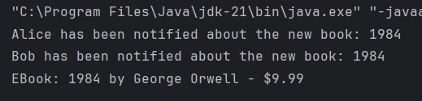

# Topic: Behavioral Design Patterns

**Author:** Ceban Vasile
---

## Introduction

Behavioral design patterns are crucial in defining how objects interact and communicate within a system. These patterns focus on improving communication between disparate objects while ensuring loose coupling. I have implemented the Observer Pattern, in a Library Management System. This pattern facilitates event-driven interactions by notifying multiple dependent object of state changes in a subject.

## Theory and Motivation

Behavioral patterns describe how objects interact and transfer responsibilities. They focus on defining clear and efficient communication channels while maintaining independence between components. The Observer Pattern is a prime example of such a design.

### Observer Pattern Overview
The Observer Pattern establishes a one-to-many dependency between users. When the state of one book changes, all its dependent users are notified and updated automatically.

## Objectives

1. Implement the Observer Pattern in a Library Management System.
2. Create a system where library members receive real-time notifications about book additions or availability.
3. Maintain loose coupling between the catalog and its subscribers.
---

## Implementation & Explanation

### Project Structure

The project is organized into the following packages to maintain clarity and modularity:
- **client**: Contains the main application that interacts with other components.
- **models**: Represents observe behavioral design pattern implementations.

### **Observe Pattern** ###

1. **Subject Interface**
   The Subject interface defines methods for managing observers:

**Code Snippet:**
```java
public interface Subject {
    void registerObserver(Observer observer);
    void removeObserver(Observer observer);
    void notifyObservers(String bookTitle);
}
```

2. **Observer Interface**
   The Observer interface defines a method to receive updates:

**Code Snippet:**
```java
public interface Observer {
    void update(String bookTitle);
}

```
3. **BookCatalog (Subject Implementation)**
   The BookCatalog class implements the Subject interface. It maintains a list of observers and notifies them when a new book is added:

**Code Snippet:**
```java
public class BookCatalog implements Subject {
    private List<Observer> observers = new ArrayList<>();
    private List<Book> books = new ArrayList<>();

    @Override
    public void registerObserver(Observer observer) {
        observers.add(observer);
    }

    @Override
    public void removeObserver(Observer observer) {
        observers.remove(observer);
    }

    @Override
    public void notifyObservers(String bookTitle) {
        for (Observer observer : observers) {
            observer.update(bookTitle);
        }
    }

    public void addBook(Book book) {
        books.add(book);
        notifyObservers(book.getTitle());
    }
}
```
4. **User (Observer Implementation)**
   The User class represents an observer that receives updates about new books:

**Code Snippet:**
```java
public class LibraryMember implements Observer {
    private String name;

    public LibraryMember(String name) {
        this.name = name;
    }

    @Override
    public void update(String bookTitle) {
        System.out.println(name + " notified: New book added - " + bookTitle);
    }
}
```

## Results and Screenshots
1. Upon adding a book to the catalog, all registered observers are notified.
2. Removing an observer prevents it from receiving further notifications.

**Code Snippet:**

```java
public static void main(String[] args){

    BookCatalog catalog = BookCatalog.getInstance();
    Observer user1 = new User("Alice");
    Observer user2 = new User("Bob");

    catalog.registerObserver(user1);
    catalog.registerObserver(user2);

    Book ebook = BookFactory.createBook("ebook", "1984", "George Orwell", 9.99);

    catalog.addBook(ebook);

    catalog.displayCatalog();
}
```
**Screenshot:**



## Conclusions
The implementation of the Observer Pattern in the Library Management System demonstrates its effectiveness in enabling real-time communication between objects. By decoupling the catalog from its subscribers, the system achieves flexibility and scalability.